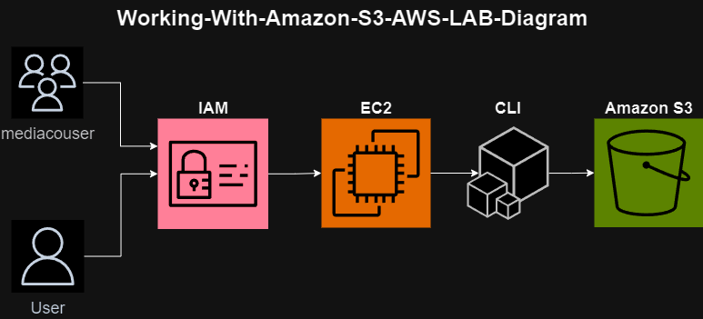

# Working with Amazon S3 Lab Guide

## Introduction

This guide provides step-by-step instructions for completing a lab that involves working with various AWS services including EC2, Amazon S3, SNS, CLI, and IAM. In this lab, you will set up an Amazon S3 bucket to share images with an external user, configure event notifications for changes to the bucket, and test the setup using AWS CLI commands.

## Objectives

By the end of this lab, you will be able to:

- Create and configure an S3 bucket using AWS CLI commands
- Verify permissions for a user on an S3 bucket
- Configure event notifications on an S3 bucket

## Duration

This lab requires approximately 90 minutes to complete.

## Lab Instructions

### Accessing the AWS Management Console

1. **Start Lab**: Launch your lab from the provided link.
2. Wait until the lab status indicates "ready", then close the Start Lab panel.
3. Choose "AWS" at the top of the instructions to open the AWS Management Console in a new browser tab.
4. Copy the AccessKey and SecretKey values from the Credentials panel and paste them into a text editor for later use.

### Task 1: Connecting to the CLI Host EC2 instance and configuring the AWS CLI

1. Connect to the CLI Host EC2 instance using EC2 Instance Connect.
2. Configure the AWS CLI on the CLI Host instance by running `aws configure` and entering the prompted values.

### Task 2: Creating and initializing the S3 share bucket

1. Use AWS CLI commands to create the S3 bucket and upload images to it.
2. Verify that the images are successfully uploaded to the bucket.

### Task 3: Reviewing the IAM group and user permissions

1. Review the permissions assigned to the `mediaco` IAM user group and the `mediacouser` IAM user.
2. Test the permissions by performing various actions on the S3 bucket as the `mediacouser` user.

### Task 4: Configuring event notifications on the S3 share bucket

1. Create an SNS topic (`s3NotificationTopic`) and configure its access policy.
2. Subscribe to the SNS topic.
3. Add an event notification configuration to the S3 bucket.

### Task 5: Testing the S3 share bucket event notifications

1. Configure the AWS CLI client software to use the `mediacouser` credentials.
2. Test the event notifications by performing actions on the S3 bucket and verifying email notifications.

## Conclusion

Congratulations! You have successfully completed the lab, which involved creating and configuring an S3 bucket, verifying permissions, configuring event notifications, and testing the setup using AWS CLI commands.

## Additional Resources

- [AWS CLI documentation for S3](https://docs.aws.amazon.com/cli/latest/reference/s3/index.html)
- [AWS CLI documentation for S3API](https://docs.aws.amazon.com/cli/latest/reference/s3api/index.html)
- For more information about AWS Training and Certification, visit the [AWS Training and Certification website](https://aws.amazon.com/training/).

Your feedback is valuable. If you have any suggestions or corrections, please provide them through the [AWS Training and Certification Contact Form](https://www.aws.training/ContactUs).

© 2023, Amazon Web Services, Inc. or its affiliates. All rights reserved. This work may not be reproduced or redistributed without prior written permission from Amazon Web Services, Inc. Commercial copying, lending, or selling is prohibited.
