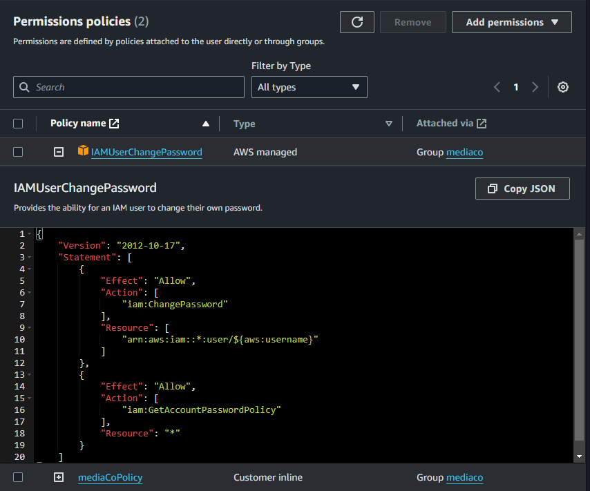
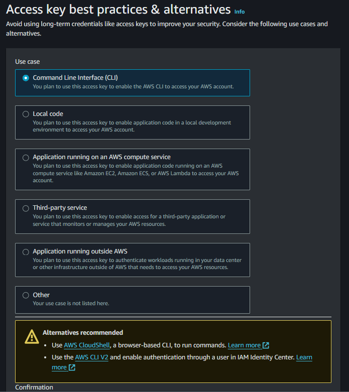
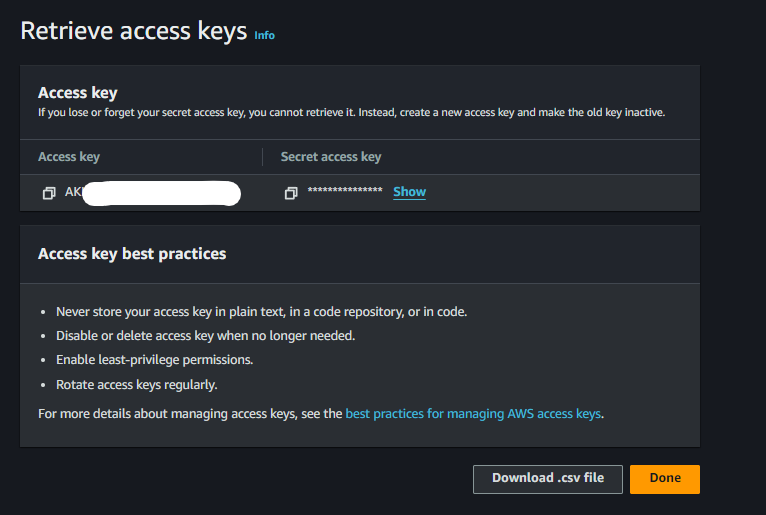
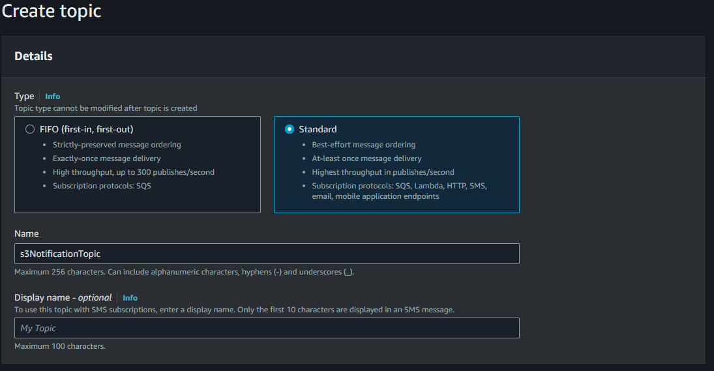
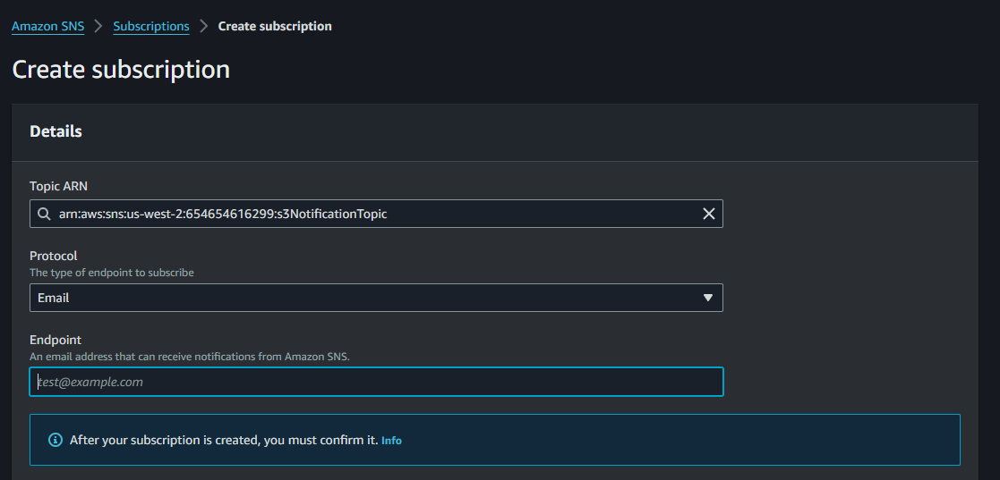
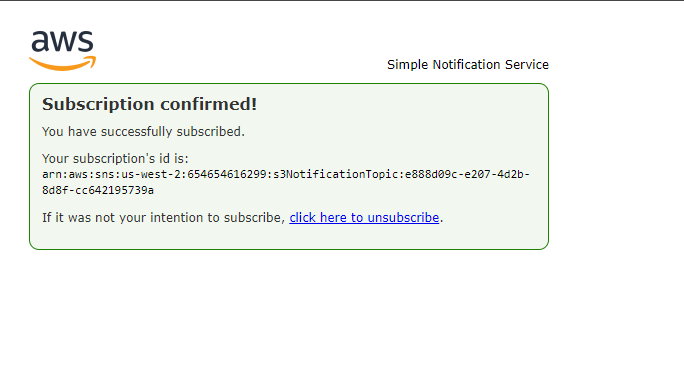
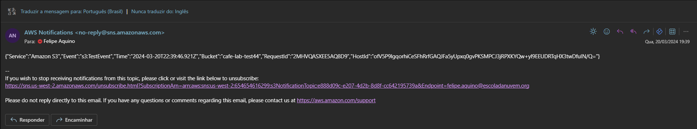
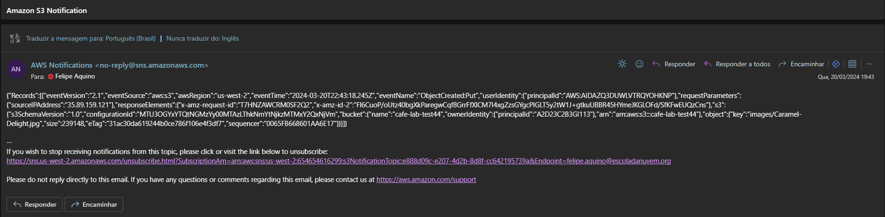
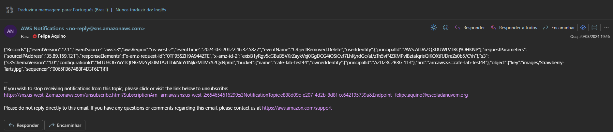

# Lab Instructions: AWS Services Setup

## IAM Policy

### Description
This section covers the creation and review of IAM policies for managing access to AWS resources.

### Instructions
- Navigate to the IAM Management Console.
- Review the permissions assigned to IAM user groups.
- Explore IAM policies and their configurations.

## Creating Access Keys

### Description
Learn how to generate access keys for IAM users, which are required for programmatic access to AWS services.

### Instructions
- Access the IAM Management Console.
- Select an IAM user.
- Generate access keys for the user.

## Access Keys

### Description
This section explains the usage and management of access keys for accessing AWS services via the AWS CLI or SDKs.

### Instructions
- Understand the purpose of access keys.
- Learn how to securely manage and store access keys.

## Creating SNS Topic

### Description
Discover how to create an Amazon SNS topic for sending notifications to subscribers.

### Instructions
- Navigate to the Amazon SNS Management Console.
- Create a new SNS topic.
- Configure the topic's settings and permissions.

## Creating SNS Subscription

### Description
Learn how to subscribe to an Amazon SNS topic to receive notifications via various delivery protocols.

### Instructions
- Access the Amazon SNS Management Console.
- Subscribe to a specific SNS topic.
- Choose the desired delivery protocol (e.g., Email, SMS, Lambda).

## Subscription Confirmed

### Description
Understand the confirmation process for subscribing to an Amazon SNS topic.

### Instructions
- Verify the subscription confirmation email.
- Confirm the subscription to start receiving notifications.

## SNS Email Notifications

### Description
Receive and analyze sample Amazon SNS email notifications.

### Instructions
- Monitor your email inbox for three sample notifications.
- Review the contents of each notification and understand their significance.

